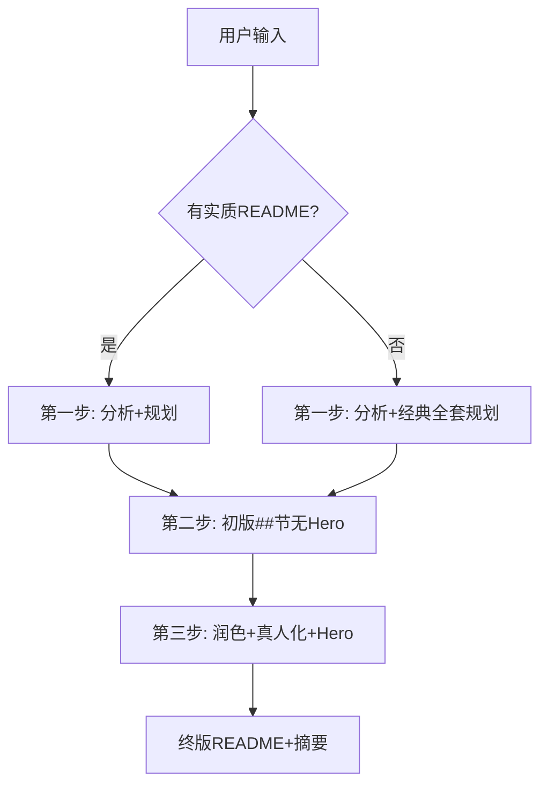

# 实现逻辑

本 skill 的完整决策流程。Agent 按序执行，不可跳步。

---

## 0. 判断输入模式

```
用户提供 README？
├── 有实质内容（## 节、段落、表格、安装命令等）
│   └── 模式 A：有 README → 尽量使用原文
└── 无 / 空 / 仅一行标题
    └── 模式 B：无 README → 生成经典全套 + 推断标题
```

---

## 1. 第一步：仓库分析 + 版块规划

| 子步 | 做什么 | 参考 |
|------|--------|------|
| 1.1 信息采集 | 有 README：盘点 H1、`##`、首段；无 README：扫仓库树 | [intake.md](intake.md) |
| 1.2 仓库分析 | 类型、核心能力、读者、入口、版块提示 | [repo-analysis.md](repo-analysis.md) |
| 1.3 版块规划 | 定 `##` 顺序；Why 必选；保留独有节 | [section-catalog.md](section-catalog.md)、[preserve-content.md](preserve-content.md)、[no-readme-scaffold.md](no-readme-scaffold.md) |
| 1.4 导航草案 | `{标签 → ## → 预计 href}` 核对表 | [nav-design.md](nav-design.md) |

**产出（不写 README）**：仓库画像、`##` 顺序、导航草案、`GAPS[]`。

---

## 2. 第二步：初版版块实现

| 模式 | 策略 |
|------|------|
| **A 有 README** | 迁移原文到规划槽位；H1 保留；补 Why |
| **B 无 README** | 推断 H1；生成经典全套各节内容 |

共用规则见 [draft-implementation.md](draft-implementation.md)：

- H1 + tagline + emoji + 全部 `##` 正文  
- **不写 Hero HTML**  
- FAQ 可先 bullet；Install/Usage 可先无引导句  

**产出**：`README.md` 初稿（无 Hero 导航块）。

---

## 3. 第三步：润色 + 真人化 + Hero

| 子步 | 做什么 | 参考 |
|------|--------|------|
| 3.1 连贯润色 | 节间衔接、Why 独立、去重复 | [content-polish.md](content-polish.md) |
| 3.2 真人化 | 去 AI 腔、FAQ 问答体 | [humanize-content.md](humanize-content.md) |
| 3.3 锚点验证 | 按定稿 `##` 重算 href | [nav-design.md](nav-design.md) |
| 3.4 写 Hero | 验证通过后输出 HTML 导航 | [readme-template.md](readme-template.md) |

**产出**：终版 `README.md`。

---

## 4. 输出 README + 对话摘要

1. 完整 `README.md`（居中 Hero + 正文 `##`）
2. 对话末尾固定输出「美化摘要」+「待你补充」（[followup-template.md](followup-template.md)）  
3. Star History **默认不加**

---

## 决策总览

```text
输入
  → 有 README？
       是 → 模式 A：H1/正文尽量用原文
       否 → 模式 B：推断 H1 + 经典全套
  → 第一步：仓库分析 + 定 ## + 导航草案（不写文件）
  → 第二步：初版 README（## 齐全，无 Hero）
  → 第三步：润色 + 真人化 + 验证锚点 + 写 Hero
  → 美化摘要 + 待你补充
```


